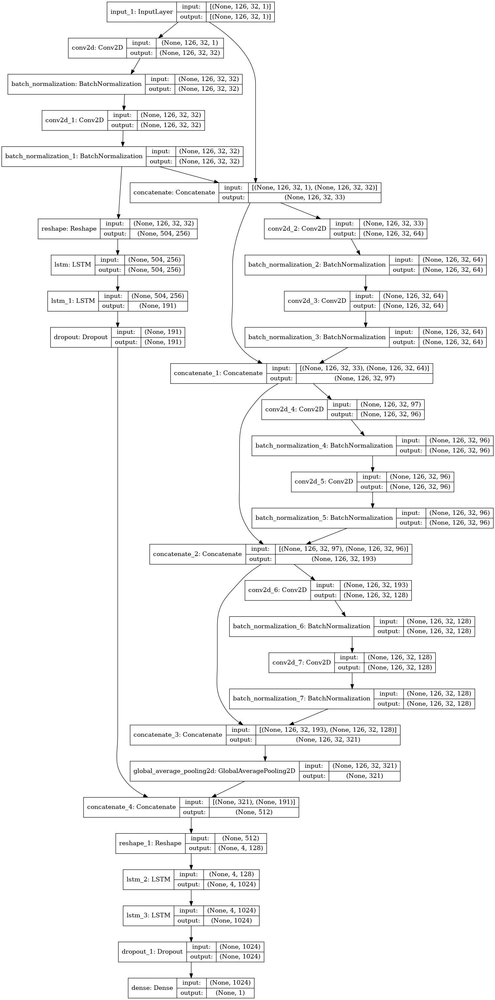

# mafat-seekers

**Result** - [We finished Rank 23 Globally with AUC 0.9028, Teamname - Seekers](https://competitions.codalab.org/competitions/25389#results)

## Competition 

### MAFAT Radar Challenge - Can you distinguish between humans and animals in radar tracks?

#### Data

The dataset consists of signals recorded by ground doppler-pulse radars. Each radar “stares” at a fixed, wide area of interest. Whenever an animal or a human moves within the radar’s covered area, it is detected and tracked. The dataset contains records of those tracks. The tracks in the dataset are split into 32 time-unit segments. Each record in the dataset represents a single segment. The dataset is split to training and test sets; the training set contains the actual labels (humans or animals). 

A segment consists of a matrix with I/Q values and metadata. The matrix of each segment has a size of 32x128. The X-axis represents the pulse transmission time, also known as “slow-time”. The Y-axis represents the reception time of signals with respect to pulse transmission time divided into 128 equal sized bins, also known as “fast-time”. The Y-axis is usually referred to as “range” or “velocity” as wave propagation depends on the speed of light. For example, for Pulse Repetition Interval (PRI) of 128 ms, each Y-axis is a bin of 1 ms. For pulse sent in t(n) and a signal received in t(n+m) where 0<m<=128 the signal is set in the “m” bin of pulse n (the numbers are not the real numbers and are given only for the sake of the example).

The radar’s raw, original received signal is a wave defined by amplitude, frequency, and phase. Frequency and phase are treated as a single-phase parameter. Amplitude and phase are represented in polar coordinates relative to the transmitted burst/wave. Polar coordinate calculations require frequent sine operations, making calculations time-consuming. Therefore, upon reception, the raw data is converted to cartesian coordinates, i.e., I/Q values. The values in the matrix are complex numbers: I represents the real part, and Q represents the imaginary part.

The I/Q matrices that are supplied to participants have been standardized, but they have not been transformed or processed in any other way. Therefore, the data represents the raw signal. Different preprocessing and transformation methods, such as Fourier transform, can and should be used in order to model the data and extract meaningful features. For more information, see “Signal Processing” methods or view the links at the bottom for more information.

The metadata of a segment includes track id, location id, location type, day index, sensor id and the SNR level. The segments were collected from several different geographic locations, a unique id was given per location. Each location consists of one or more sensors, a sensor belongs to a single location. A unique id was given per sensor. Each sensor has been used in one or more days, each day is represented by an index. A single track appears in a single location, sensor and day. The segments were taken from longer tracks, each track was given a unique id.

We have to identify between humans and animals(2 classes) using this data.

#### Data Analysis

There are only ~500 odd datapoints of humans. Rest ~5500 data points are of animals. We also found that there is very minimal difference in pattern in the data between humans and animals.

We also figured out that we would need to reason about the data temporally as well. This is because the datapoints capture the movement of animal/ human across time. Our model needs to do spatial as well as temporal pattern reccognition.

### Model Architecture

The best performing model had the following architecture

To handle data imbalance, we trained the model with Binary Focal Loss.

### Execute the repo - 

The project is batteries included.

1. `cd <proj-src>/models/top_model/.`
2. Change the path of the data in `MAFAT_Radar_CRNN_lstm_middle_focal_loss.py`
3. Run the code - `python3 MAFAT_Radar_CRNN_lstm_middle_focal_loss.py``

